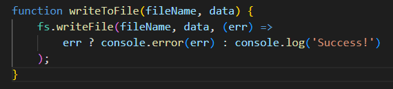
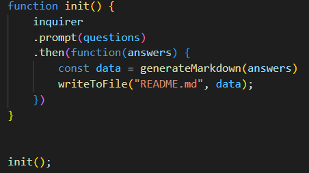
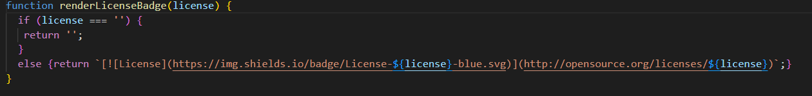
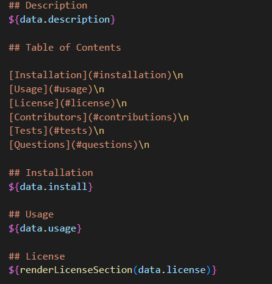

# ReadMeGenerator

## Description
This is application to generate a README.md file for your own project that includes licenses with badges, a clickable Table of Contents, and a link to the user's GitHub profile and e-mail address.

## Table of Contents

[Installation](#installation)

[Usage](#usage)

[License](#license)

[Contributors](#contributions)

[Tests](#tests)

[Questions](#questions)

## Installation
Visit my GitHub repository featured in the Questions section below. Find the ReadMeGenerator repository. Clone the SSH down from my the repository into your own terminal and enjoy! Node must be installed to use this application and you must be within the file path that contains 'index.js'. After you have gone through the installation process, run the 'node index.js' command in your terminal. A series of prompts will appear.

## Usage

I am including some examples of my code to demonstrate the functionality. This is function to write the data to the md file. It features a ternary operator to inform the user if that task has been completed successfully.

Next I have included a photo of my function to initialize my Inquirer prompts and record the answers given by the user to my 'generateMardown.js' file.

The next example is referring to one of many license sites so I could pull the badge image.

Next I used the user-given data from the prompts to fill in the desired fields. I also used this to create my Table of Contents.

Ultimately, when all put together it will look like this video example. 

[WorkingEx01](https://drive.google.com/file/d/1YFh7Cef8pu3KwHJFHSBYFKPj5fnTvhfJ/view?usp=sharing)

## License 
This application is licensed by MIT

## Contributions
The Studious Studiers Discord!!

## Tests
Many sample READMEs were made. No READMEs were hurt in the making of this application.

## Questions
You can reach me at stefanibusiness@gmail.com or via GitHub [DStefani86](https://github.com/DStefani86)
